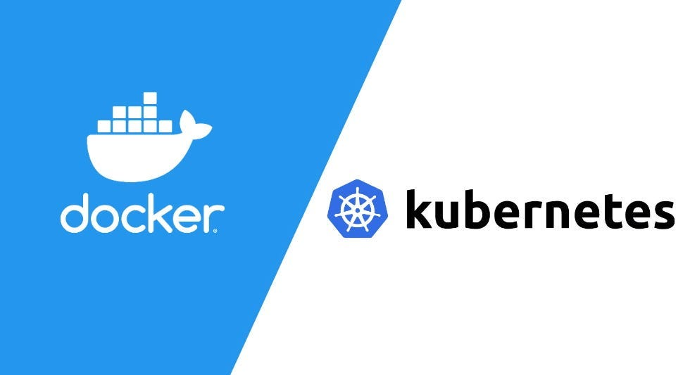

# FastAPI Demo Pipeline

Hey there! 👋 I'm excited to share an end-to-end example that walks you through:

1. **Writing** a simple FastAPI server with health, GET, and POST endpoints
2. **Packaging** that server into a Docker container
3. **Pushing** the image to Docker Hub
4. **Deploying** the container on a Kubernetes cluster
5. **Inspecting** and managing your app with `kubectl`
6. (Bonus) **Automating** the whole flow with a CI/CD pipeline

---
## Pipeline Architecture



## 📋 Prerequisites

- **Python 3.11+**
- **Docker** installed and running
- **kubectl** CLI configured
- **Kubernetes** (either Docker Desktop’s built-in or Minikube)

---

## 🚀 Getting Started

### 1. Clone this repository

```bash
git clone https://github.com/yourusername/fastapi-demo.git
cd fastapi-demo
```

### 2. Run the API locally in Docker

```bash
# Build the Docker image
docker build -t fastapi-demo:latest .

# Run the container
docker run --rm -d -p 8000:8000 --name fastapi-demo fastapi-demo:latest

# Check the health endpoint
curl http://localhost:8000/
# → { "status": "healthy" }
```

### 3. Push to Docker Hub

1. Create a repository on Docker Hub, e.g. `yourdockerid/fastapi-demo`.  
2. Tag and push:

   ```bash
   docker tag fastapi-demo:latest yourdockerid/fastapi-demo:latest
   docker push yourdockerid/fastapi-demo:latest
   ```

---

## ☸️ Deploying to Kubernetes

1. **Enable Kubernetes**  
   - Docker Desktop: Settings → Kubernetes → Enable → Apply & Restart  
   - Minikube: `minikube start`

2. **Apply manifests**:

   ```bash
   kubectl apply -f deployment.yaml
   kubectl apply -f service.yaml
   ```

3. **Verify** your pods and service:

   ```bash
   kubectl get pods -l app=fastapi-demo
   kubectl get svc fastapi-demo-svc
   ```

4. **Access your API**:

   ```bash
   curl http://localhost/user/111
   # or via NodePort/LoadBalancer external IP
   ```
---

## ✨ CI/CD Automation (Bonus)

You’ll find a sample GitHub Actions workflow in `.github/workflows/ci-cd.yaml` that:

1. Builds the Docker image  
2. Pushes to Docker Hub  
3. SSH’s into your server/cluster and triggers a rolling restart  

---

## 🤝 Acknowledgments

Thanks for checking this out! Feel free to tweak, fork, and make it your own. If you run into any issues, drop me a line or open an issue here on GitHub.
